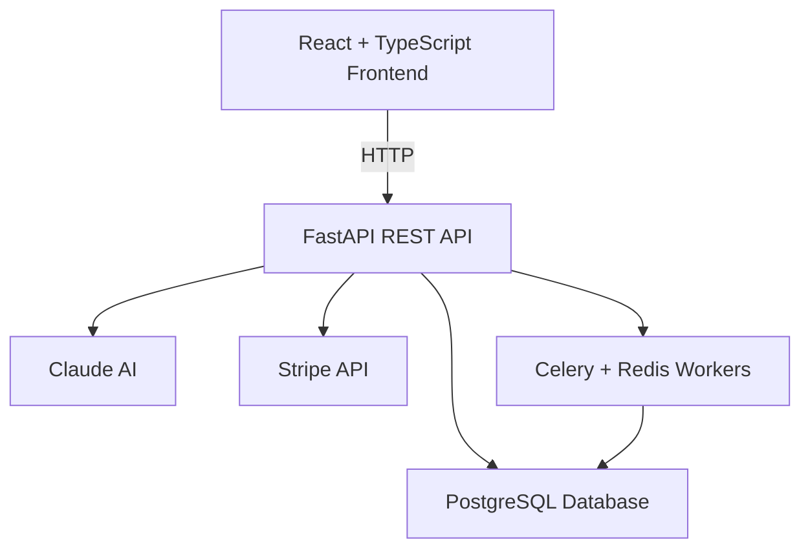

# AI Finance Ops Platform

A production-grade, multi-tenant SaaS billing and finance operations platform with AI-powered insights.

## Live Demo

- **Frontend:** https://hloganathan08.github.io/ai-finance-ops/
- **Backend API:** https://ai-finance-ops.onrender.com
- **API Docs:** https://ai-finance-ops.onrender.com/docs

## Tech Stack

**Backend**
- FastAPI + Python 3.11
- PostgreSQL + SQLAlchemy + Alembic
- Redis + Celery (async workers)
- Stripe API (payments + webhooks)
- Claude AI (billing intelligence)
- JWT authentication + multi-tenancy

**Frontend**
- React 18 + TypeScript
- Tailwind CSS v3
- Recharts (revenue charts)
- React Router v6
- Axios

## Features

- **Multi-tenant architecture** — isolated data per organization with JWT-scoped requests
- **Subscription management** — create, upgrade, cancel plans with full lifecycle tracking
- **Payment processing** — Stripe integration with idempotent webhook handling and retry logic
- **Transaction audit log** — immutable record of every billing event with refund support
- **AI billing insights** — natural language queries over billing data powered by Claude API
- **Real-time dashboard** — revenue charts, payment success rates, subscription metrics
- **Async workers** — Celery + Redis for invoice generation and background billing tasks

## Architecture


## Getting Started

### Prerequisites
- Python 3.11+
- Node 18+
- PostgreSQL 16+
- Redis

### Backend Setup
```bash
cd backend
python3 -m venv venv
source venv/bin/activate
pip install -r requirements.txt
cp .env.example .env
alembic upgrade head
uvicorn app.main:app --reload
```

### Frontend Setup
```bash
cd frontend
npm install
npm run dev
```

### Environment Variables
DATABASE_URL=postgresql://user@localhost:5432/ai_finance_ops
REDIS_URL=redis://localhost:6379/0
SECRET_KEY=your-secret-key
STRIPE_SECRET_KEY=sk_test_...
STRIPE_WEBHOOK_SECRET=whsec_...
ANTHROPIC_API_KEY=sk-ant-...

## API Endpoints

| Method | Endpoint | Description |
|--------|----------|-------------|
| POST | `/api/v1/auth/register` | Register tenant + owner |
| POST | `/api/v1/auth/login` | Login and get JWT |
| GET | `/api/v1/plans` | List all plans |
| POST | `/api/v1/subscriptions` | Subscribe to a plan |
| GET | `/api/v1/transactions` | List transactions |
| POST | `/api/v1/transactions/refund` | Process refund |
| GET | `/api/v1/dashboard/overview` | Dashboard metrics |
| POST | `/api/v1/ai/query` | AI billing query |

## Key Technical Decisions

- **Idempotency keys** on all payment transactions prevent duplicate charges
- **Tenant isolation** enforced at the database query level via JWT claims
- **Immutable audit log** records every state change for compliance
- **Structured AI output** — Claude returns JSON with answer, data points, and anomalies
- **Exponential backoff** on failed payment retries via Celery workers

## Resume Metrics This Project Demonstrates

- Multi-tenant SaaS architecture with isolated billing data per organization
- Stripe webhook pipeline with signature validation and idempotent event handling
- AI-powered natural language billing queries using Claude API with structured JSON output
- Async invoice generation and retry logic via Celery + Redis workers
- Full transaction lifecycle: plan creation → payment → refund → audit log
